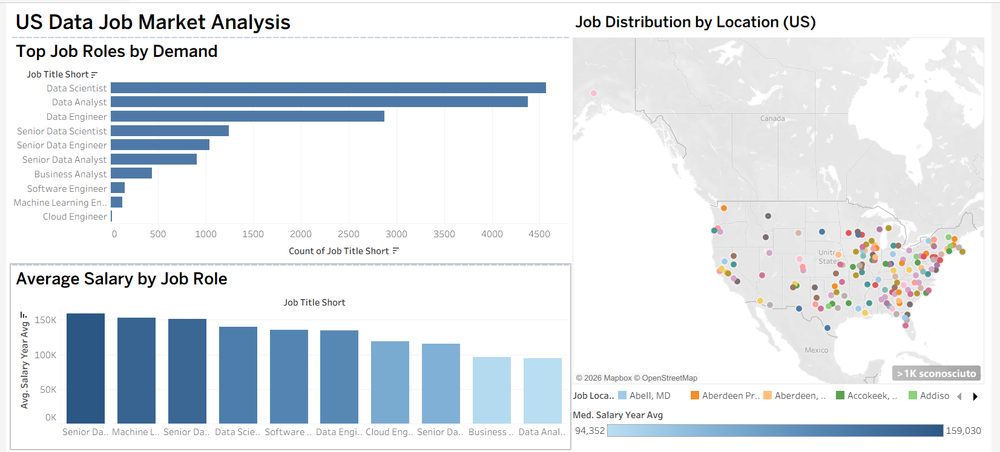

# 📊 Data Job Market Analysis (SQL | Power BI | Tableau)

## 📌 Project Overview

This project analyzes the global data job market using SQL (SQLite), Power BI, and Tableau.

The goal is to identify:

* High-paying job roles
* Most in-demand positions
* The impact of technical skills (e.g., Python)
* Job market trends with a focus on the United States

---

## 🛠 Tools & Technologies

* **SQLite** → Data cleaning and analysis
* **Power BI** → Business dashboard and KPIs
* **Tableau** → Advanced data visualization and storytelling

---

## 🧹 Data Cleaning (SQL)

The dataset was cleaned using SQL by:

* Removing records with missing salary values
* Creating a clean dataset (`jobs_clean`) for analysis

---

## 📊 SQL Analysis

Key SQL analyses performed:

* Top paying job roles
* Job demand by role
* Job distribution by country
* Salary comparison (Python vs No Python)
* US-focused job analysis

All queries are available in:
👉 https://github.com/hadiasadat/data-job-market-analysis/blob/main/sql/analysis.sql
## 🇺🇸 US Market Analysis
---

📈 Power BI Dashboard

A Power BI dashboard was created to visualize key insights from the dataset.

Key Features:
KPI cards (Average Salary, Total Jobs)
Job demand by role
Salary distribution
US-focused analysis
Remote vs Non-remote comparison

📂 File available in:
[/powerbi/data_job_dashboard.pbix](https://github.com/hadiasadat/data-job-market-analysis/blob/main/powerbi/data_job_dashboard.pbix)

---

📊 Tableau Dashboard

An interactive Tableau dashboard was developed to analyze the US data job market.

Key Insights:
Most in-demand roles (Data Scientist, Data Analyst)
Highest paying positions
Job distribution across US locations
Salary comparison across roles
### 📸 Dashboard Preview

🔗 View Interactive Dashboard:
👉 https://public.tableau.com/app/profile/hadia.sadat/viz/datajobs/Dashboard1?publish=yes

---

## 🔍 Key Insights

* 💰 **Senior Data Scientist** is the highest-paying role (~$154K)
* 📈 **Data Scientist and Data Analyst** are the most in-demand roles
* 🧠 Jobs requiring **Python** offer higher salaries (~$132K vs ~$110K)
* 🇺🇸 The **United States** has the highest concentration of data jobs

---

## 📂 Project Structure

* `/data` → dataset
* `/sql` → SQL queries
* `/powerbi` → Power BI dashboard file (.pbix)
* `/tableau` → Tableau workbook (.twb/.twbx)

---

## 🚀 Future Improvements

* Advanced skill extraction (Python, SQL, Excel)
* Predictive salary analysis
* Interactive dashboards with more filters

---

## 👩‍💻 Author: Hadia Sadat

